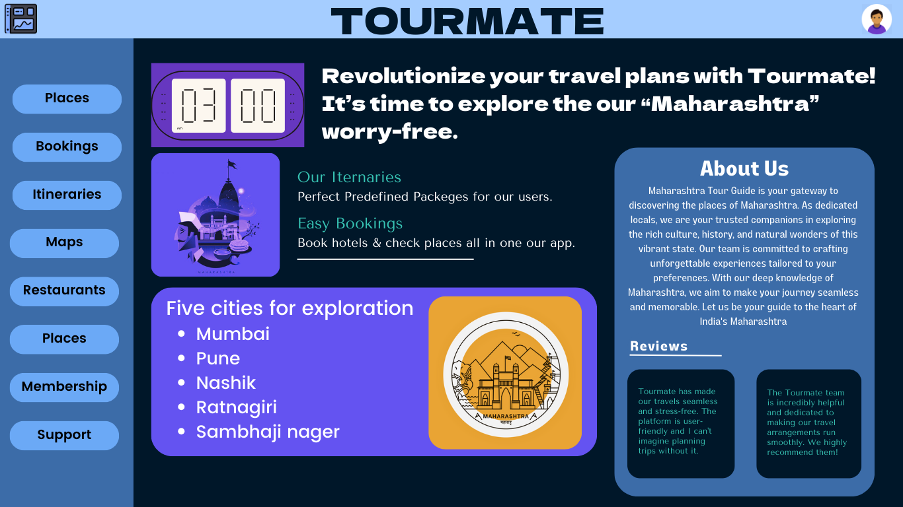

# Tourmate Travel Planning Application

The "Tourmate" travel planning application is a comprehensive and user-centric desktop-based solution designed to enhance the travel planning experience. With a seamless and intuitive interface, it offers dedicated sections for every aspect of travel, ensuring a hassle-free journey.

## DASHBOARD 

## Key Features

- **User Registration:** Create an account to personalize your travel experience.
- **City Information:** Explore detailed information about five cities in Maharashtra - Mumbai, Pune, Nashik, Ratnagiri, and Sambhaji Nagar.
- **Travel Booking:** Conveniently book travel tickets for a smooth journey.
- **Accommodation Booking:** Find and reserve affordable hotels for a comfortable stay.
- **Predefined Packages:** Access perfectly curated travel packages to streamline your journey planning process.
- **Car Rental Services:** Easily rent local cars to explore your destination conveniently.
- **Restaurants:** Discover a comprehensive listing of the finest restaurants to savor local cuisines.
- **Maps:** Navigate with ease using integrated maps.
- **Itineraries:** Plan your trips meticulously with dedicated itinerary management.
- **About Us:** Learn more about the Tourmate application and its mission.
- **Our Itineraries:** Find inspiration by exploring our curated itineraries.
- **Reviews:** Gain insights from fellow travelers through user reviews.
- **Support:** Access responsive customer support whenever needed.

## Getting Started

### Prerequisites

- Java Development Kit (JDK) installed
- MySQL database

### Build and Run

1. Clone the repository:

   ```bash
   git clone https://github.com/carpentarycoder/Tourmate.git
   ```

2. Navigate to the project directory:

   ```bash
   cd tourmate
   ```

3. Import the database using MySQL.

4. Compile the Java code:

   ```bash
   javac Main.java
   ```

5. Run the application:

   ```bash
   java Main
   ```

## Author

SUTAR -(https://github.com/carpentrycoder)

## License

This project is licensed under the MIT License - see the [LICENSE](LICENSE) file for details.

## Project Information

- **Project:** Java-based Travel Management System (TMS) for 5 cities in Maharashtra
- **Technologies:** Java programming language, MySQL database
- **Implementation Steps:** Requirements gathering, system design, database design, user-friendly interface, user authentication with security policy.
- **Support Plan:** Ongoing support and maintenance
- **Web-Based App Promotion:** Visit [Tourmate - Plan Your Trip](https://tourmate-plan-your-trip.framer.ai/)

## Benefits

- Improved travel planning experience
- Increased efficiency in organizing trips
- Enhanced user satisfaction

Feel free to explore, contribute, and create unforgettable travel experiences with "Tourmate"!

**Note: This project is licensed under the [MIT License](LICENSE).**
